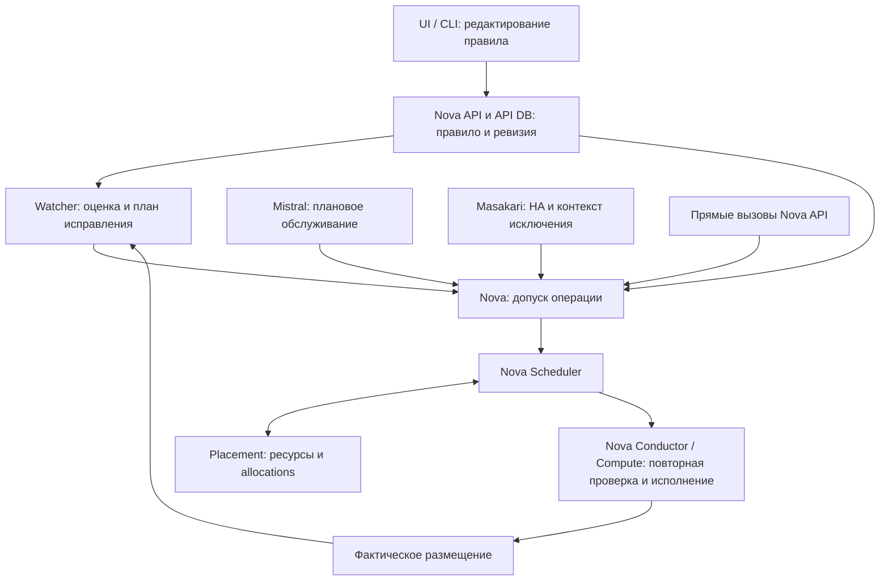

# Изменяемые правила размещения ВМ: Nova, Placement, Watcher, Mistral и Masakari

Дата исследования: 29.09.2026. База: OpenStack 2025.1 / Epoxy и доступные локальные доработки PVS/PowerOps.

Статус: исследование и архитектурная рекомендация для обсуждения. Реализация не выполнялась; работающий кластер и установленные образы не проверялись. Приведённые ниже новые поля, состояния и интерфейсы — предложение, а не существующее API OpenStack.

## 1. Краткий вывод

**Рекомендую сочетание: Nova хранит и обеспечивает соблюдение правил; Placement проверяет ресурсы; Watcher приводит существующее размещение к правилам; Mistral ведёт плановые операции; Masakari — аварийное восстановление.**

Проверять обязательное правило только в Mistral/Masakari/Watcher недостаточно: создание ВМ, ручная миграция и другие операции Nova могут идти мимо этих компонентов. Проверять правило только в Nova Scheduler тоже недостаточно: изменение правила не запускает само по себе миграцию работающих ВМ, а между выбором хоста и исполнением меняется состояние кластера.

Нужны три связанные функции:

1. **Управление правилом:** создать, изменить состав/режим, включить, выключить, удалить; хранить версию и статус применения.
2. **Допуск операции в Nova:** проверить допустимость цели и не позволить другим инициаторам обойти обязательное ограничение.
3. **Приведение размещения к правилу:** рассчитать последовательность live migration, выполнить её и подтвердить фактическое состояние.

Наши доработки дают полезную основу для выполнения операций и координации, но полного механизма изменяемых правил в исследованном наборе нет.

**Уточнение пользователя, принятое в этом исследовании:** поведение при отказе должно быть отдельной настройкой каждого правила. Обязательность в обычном режиме и разрешение временного нарушения при HA — разные параметры.

## 2. Как трактовать требование

| Требование | Необходимое поведение |
|---|---|
| На разных гипервизорах, обязательно | Новое штатное размещение не допускает совместного выполнения членов правила на одном гипервизоре |
| На разных гипервизорах, желательно | Система предпочитает разнести ВМ, но допускает совместное размещение и показывает отклонение |
| На одном гипервизоре, обязательно | Штатное размещение удерживает группу вместе; групповое перемещение требует отдельного переходного режима |
| На одном гипервизоре, желательно | Система предпочитает совместное размещение, но допускает распределение |
| Добавить/удалить существующую ВМ | Меняется состав правила без пересоздания ВМ; при необходимости запускается переразмещение |
| Применить без остановки | ВМ, требующие переноса, перемещаются через live migration; неподдерживаемая миграция даёт явный блокирующий результат |
| Редактирование во время жизненного цикла | Новая версия правила согласуется с уже запущенными build/migration/evacuation/start |
| Отдельное поведение при HA | При дефиците допустимых целей правило либо удерживается, либо разрешает исключение именно для восстановления |

Под «гипервизором» здесь понимается физический KVM compute с одним `nova-compute`/compute node. Если в инфраструктуре соответствие иное, идентификатор области размещения нужно определить отдельно; сравнение строк hostname не должно заменять модель идентичности узла.

«Без остановки» следует закрепить как отсутствие требуемого пользователем shutdown/reboot для применения правила. Live migration имеет ограничения совместимости и короткую фазу переключения; это не обещание нулевой паузы приложения. В Epoxy live migration ограничена одной cell. Нельзя обещать применение любой новой комбинации правил при произвольных устройствах, storage и недостатке ресурсов. [Документация live migration](https://docs.openstack.org/nova/2025.1/admin/configuring-migrations.html).

Для обязательного правила рекомендую разделять **сохранённое пожелание** и **вступившую в силу версию**. Если работающие ВМ пока размещены иначе, новая версия имеет статус `PENDING/APPLYING`, а не «правило соблюдено». До успешного переключения продолжает действовать старая версия, с явно зарегистрированными исключениями для перехода, если они нужны.

## 3. Что уже умеет Nova и где заканчивается штатная функциональность

В Nova есть четыре политики server groups: `affinity`, `anti-affinity`, `soft-affinity`, `soft-anti-affinity`. Членство задаётся при создании сервера через scheduler hint `group`. Публичный штатный механизм не позволяет редактировать существующую группу и произвольно переносить существующий сервер между группами. Создание **новой** ВМ сразу в существующей группе возможно; это не равно присоединению уже работающей ВМ. [Server Groups, Epoxy](https://docs.openstack.org/nova/2025.1/user/server-groups.html).

По локальным исходникам Nova 31.3.1 подтверждены следующие границы:

| Механизм | Что реально делает | Чего не даёт для нашего требования |
|---|---|---|
| `ServerGroupAffinityFilter` / `ServerGroupAntiAffinityFilter` | Фильтруют цели по составу и размещению группы | CRUD изменяемых правил, план миграций, статус приведения к правилу |
| `ServerGroupSoftAffinityWeigher` / `ServerGroupSoftAntiAffinityWeigher` | Влияют на вес кандидата | Гарантию предпочтения при любых остальных весах; автоматическое исправление уже существующего размещения |
| `_validate_instance_group_policy()` на compute | Повторно проверяет жёсткую политику в нескольких путях build/move; учитывает и входящие миграции при anti-affinity | Полный протокол конкурентного изменения правил |
| `setup_instance_group()` | Подготавливает групповые сведения в `RequestSpec` | Поддержку нового изменяемого источника правил без изменений кода |
| `start_instance()` | Включает ВМ на её текущем compute | Повторный выбор гипервизора через scheduler; в этом методе нет вызова проверки группы |

Источники: [фильтры Nova](https://opendev.org/openstack/nova/src/commit/e2ebb330dfc7336a995d455861b52066e270f8ca/nova/scheduler/filters/affinity_filter.py#L89), [веса Nova](https://opendev.org/openstack/nova/src/commit/e2ebb330dfc7336a995d455861b52066e270f8ca/nova/scheduler/weights/affinity.py#L36), [проверка на compute](https://opendev.org/openstack/nova/src/commit/e2ebb330dfc7336a995d455861b52066e270f8ca/nova/compute/manager.py#L1857), [подготовка RequestSpec](https://opendev.org/openstack/nova/src/commit/e2ebb330dfc7336a995d455861b52066e270f8ca/nova/scheduler/utils.py#L1212), [start](https://opendev.org/openstack/nova/src/commit/e2ebb330dfc7336a995d455861b52066e270f8ca/nova/compute/manager.py#L3493).

У soft-политик есть значимая тонкость: Nova суммирует веса разных weighers. Поэтому «желательно» нужно определить в продукте: это один из факторов оптимизации или приоритетное предпочтение среди всех технически допустимых целей. Если требуется второе, штатных значений весов недостаточно как доказательства — нужен согласованный порядок критериев. [Локальный код расчётных настроек](https://opendev.org/openstack/nova/src/commit/e2ebb330dfc7336a995d455861b52066e270f8ca/nova/conf/scheduler.py#L355).

Есть также известная граница параллелизма: комментарий прямо внутри проверки hard affinity указывает, что локальные блокировки на разных compute не обеспечивают её глобальную непротиворечивость. Это основание проектировать координацию по правилу и ревизии, а не считать готовый фильтр абсолютной гарантией. Это вывод из исходников, не результат нагрузочного теста текущего стенда. [Соответствующий участок Nova](https://opendev.org/openstack/nova/src/commit/e2ebb330dfc7336a995d455861b52066e270f8ca/nova/compute/manager.py#L1942).

**Вывод:** штатные server groups закрывают базовые режимы первоначального размещения, но не всё заявленное управление жизненным циклом правил.

## 4. Почему Placement не должен быть владельцем этих правил

Placement предоставляет ресурсную модель: resource providers, inventories, traits, aggregates, allocations и allocation candidates. Его `group_policy=isolate` относится к группам ресурсного запроса, а не к изменяемой группе нескольких ВМ. Например, разделение двух запросов к устройствам по providers нельзя считать VM–VM anti-affinity. [Placement API](https://docs.openstack.org/api-ref/placement/).

Для предлагаемой архитектуры Placement остаётся источником проверки доступности ресурсов и механизмом ресурсных claims. Правило вида «ВМ A и B должны выполняться раздельно» оценивает Nova, располагающая идентичностью ВМ, их состояниями и операциями жизненного цикла.

Преобразовывать каждую группу ВМ в набор traits/aggregates хостов не рекомендую: членство и размещение ВМ меняются независимо от свойств ресурсов. Такое отражение потребует отдельной синхронизации, не решит применение к работающим ВМ и создаст гонки. Это архитектурная оценка, а не запрет API.

Также нельзя считать обычный запрос allocation candidates резервированием ресурсов для всей affinity-группы. Для группового плана потребуется отдельно спроектированная связь с фактическими Nova/Placement claims и компенсацией при сбое; имеющаяся одиночная миграция не предоставляет готовой транзакции переноса группы.

## 5. Что дают наши доработки

| Доступный компонент | Подтверждено по коду или поставке | Использование в решении |
|---|---|---|
| Mistral PowerOps | Плановое обслуживание: Masakari maintenance → disable Nova compute → обработка ВМ → проверка безопасности выключения | Сохранить оркестрацию хоста; учитывать правила до drain и перед выключением |
| Mistral live migration | `host: null`, выбор цели Nova; ожидание migration record, целевого host, `ACTIVE` и `task_state=None` | Переиспользовать критерий подтверждения и обработку неоднозначного результата |
| Masakari | Вызывает Nova evacuation; есть PowerOps fencing/координация восстановления | Добавить контекст HA, поведение выбранного правила и координацию affinity-группы |
| Watcher | Строит/исполняет планы; migration action передаёт конкретный destination в Nova | Добавить сведения о правилах в модель, оценку перед планом и проверку перед действием |
| Watcher automation hold | Подготовленная поставка блокирует новую периодическую автоматизацию после аварии | Сохранить защиту; согласовать, когда разрешено исправление нарушений после HA |
| Per-target evacuation guard | Патч Nova оборачивает восстановление на принимающем compute; регулирует допуск/параллелизм | Сохранить как отдельное ограничение ресурсов исполнения; добавить проверку актуальности правила после ожидания |

Источники: Mistral planned (`vmclone-work/mistral/mistral/actions/powerops/planned.py`, строка 42), Mistral LiveMigrationWaiter (`vmclone-work/mistral/mistral/actions/powerops/live_migration.py`, строка 248), Masakari Nova adapter (`sources/masakari-pvs_1.0.0/masakari/compute/nova.py`, строка 198), Watcher Nova helper (`sources/watcher-pvs_1.0.0/watcher/common/nova_helper.py`, строка 310), [поставки и их границы](OPENSTACK_BACKLOG.md).

В исследованном Watcher поиск и просмотр путей decision engine/applier/common не выявили оценки server-group affinity. Его способность отправлять миграции через Nova не означает, что он заранее строит допустимый план. Отказ Nova предотвратит часть нарушений, но Watcher может предлагать бесполезные действия, а soft-правило вообще не обязано вызывать отказ.

Патч принимающего Nova compute просмотрен в локальном Git-объекте commit `71b0123f390bfeaab4dc4ca2dffaa6fab32a6cdf`. Он сохраняет выбор scheduler и не реализует новые правила размещения. Предел «одна активная эвакуация на цель» не является anti-affinity: после её завершения следующая ВМ может быть восстановлена на тот же хост. [Патч Nova](https://github.com/lebtmalorny-rgb/mimaric/blob/71b0123f390bfeaab4dc4ca2dffaa6fab32a6cdf/hotfixes/masakari-per-target-evacuation/nova/0001-Guard-receiving-compute-evacuation-with-durable-per-.patch).

По локальному backlog от 23.09.2026 Watcher hold был подготовлен, но не применён; внедрение per-target guard не подтверждено. В этом исследовании статус стенда не обновлялся. Наличие исходников не означает наличие функций в работающих контейнерах.

## 6. Сопоставление с VMware

Для продуктового поведения наиболее близок **VMware Cloud Director `VmAffinityRule`**: у правила есть изменяемый набор ссылок на ВМ, направление affinity/anti-affinity, включение и обязательность, а API поддерживает обновление правила. Это хороший референс для объекта управления. При `IsMandatory=true` документация отдельно описывает запрет запуска при failover, нарушающем правило. [Cloud Director API](https://developer.broadcom.com/xapis/vmware-cloud-director-api/latest/doc/types/VmAffinityRuleType.html).

На уровне vSphere модель DRS предусматривает динамическое применение изменённых правил: система пытается исправить размещение, а при невозможности выдаёт fault/event. При ручной автоматизации формируются рекомендации. PowerCLI `Set-DrsRule` позволяет менять список ВМ существующего правила. [vSphere ClusterRuleInfo](https://developer.broadcom.com/xapis/vsphere-web-services-api/latest/vim.cluster.RuleInfo.html), [Set-DrsRule](https://developer.broadcom.com/powercli/latest/vmware.vimautomation.core/commands/set-drsrule).

Нельзя переносить формулировку «как в VMware» без указания продукта, типа правила и HA-семантики. В отдельном KB Broadcom для VM–VM anti-affinity описано, что HA может нарушить такое правило ради перезапуска, тогда как обслуживание хоста блокируется. Это не универсальная семантика всех mandatory VM–Host правил. [Broadcom KB 394815](https://knowledge.broadcom.com/external/article/394815).

Кроме того, Broadcom фиксирует проблему с ожидаемым действием `das.respectvmvmantiaffinityrules` / `das.respectvmvmaffinityrules` в vSphere 7/8. Поэтому эти флаги нельзя брать как безусловно работающую спецификацию нашего поведения. [Broadcom KB 382528](https://knowledge.broadcom.com/external/article/382528).

Архитектурный вывод из референса: заимствовать управляемый объект правила, отдельный статус соблюдения, механизм миграционного исправления и явно описанный HA-контракт. Соответствие компонентов лишь функциональное: Watcher ближе к расчёту/исполнению DRS-планов, Masakari — к HA-восстановлению; Nova остаётся общим исполнительным уровнем OpenStack.

## 7. Сравнение вариантов

| Вариант | Преимущества | Ограничения | Оценка |
|---|---|---|---|
| Правила только в Mistral/Watcher/Masakari | Можно быстро организовать миграции существующих ВМ | Прямой Nova API обходит такую проверку; несколько реализаций расходятся; гонки разных оркестраторов | Подходит для рекомендаций и ограниченного прототипа, не закрывает обязательность |
| Всё внутри Nova | Единый допуск операций и владение данными | Для автоматического исправления придётся строить в Nova отдельный оптимизатор и долговременный контроллер | Технически возможно, но увеличивает собственную логику Nova |
| Nova обеспечивает правила, Watcher исправляет размещение, Mistral/Masakari учитывают контекст | Единая семантика для всех инициаторов; используются существующие роли сервисов | Потребуется согласованный контракт версий правил, исключений и операций | **Рекомендуется** |

Разделение обязанностей в рекомендуемом варианте:

| Компонент | Ответственность |
|---|---|
| Nova API + API DB | Авторитетное хранение правила/членства/ревизии; RBAC, проверка конфликтов, lifecycle и контролируемые исключения |
| Nova Scheduler | Получить актуальную версию; отфильтровать hard-нарушения; ранжировать soft-предпочтения; выбрать технически допустимую цель |
| Nova Conductor / Compute | Проверить актуальность допуска и целевого размещения при исполнении; согласовать с migration/build/start; не допустить выполнения устаревшего плана |
| Placement | Проверить и учесть ресурсы; обслуживать стандартные claims Nova |
| Watcher | Сверить желаемое и фактическое размещение; построить и исполнить план исправления через Nova; контролировать результат |
| Mistral | Плановые операции и обслуживание хостов; учёт групповых переходов; ожидание результатов; безопасное завершение PowerOps |
| Masakari | Fencing и восстановление; передать проверяемый HA-контекст, применить настройку поведения при отказе, обработать невозможность восстановления |
| Ironic | Питание/fencing физического хоста; VM–VM правила не оценивает |



Для обычного исправления правил рекомендую использовать существующие Watcher Action Plan/Applier, доработав их. Mistral сохраняет владение плановым обслуживанием хостов. Нельзя одновременно поручать Watcher и Mistral независимое исполнение одного и того же плана переноса группы. На одну операцию нужен один владелец и общий идентификатор.

HA должно работать при остановленной балансировке Watcher. Поэтому решение об аварийном допуске и закреплении цели affinity-группы нельзя делать зависимым от работающего периодического Watcher audit.

## 8. Модель изменяемого правила

Предпочтительная модель — отдельная версионируемая сущность `PlacementRule` под управлением Nova. Это логическое имя новой функции, **не ресурс сервиса Placement**. На первом этапе не требуется отдельный микросервис с собственной копией всех данных Nova.

Пример предлагаемого представления:

```yaml
id: rule-uuid
project_id: project-uuid
name: database-replicas
relation: anti_affinity              # affinity | anti_affinity
enforcement: required                # required | preferred
ha_behavior: prefer_availability     # enforce | prefer_availability
enabled: true
members: [vm-a-uuid, vm-b-uuid]
desired_revision: 8
effective_revision: 7
apply_state: APPLYING
compliance: NON_COMPLIANT
```

Конфигурация, процесс применения и соблюдение — разные измерения. Например, правило может быть действующим, но временно нарушенным по разрешённому HA-исключению. В UI нужно показывать причину, затронутые ВМ и состояние исправления, а не только один флаг «включено».

Предлагаемые значения HA:

| Обычная строгость | HA-настройка | Поведение при невозможности выполнить правило |
|---|---|---|
| `required` | `enforce` | Сохранить обязательность, показать блокировку восстановления, ожидать допустимые ресурсы/решение оператора |
| `required` | `prefer_availability` | Сначала искать соблюдающую правило цель; если мешает именно правило — допустить адресное HA-исключение |
| `preferred` | `enforce` | Сделать правило обязательным именно для HA; это намеренное усиление, UI должен это явно объяснить |
| `preferred` | `prefer_availability` | Стараться соблюсти правило; восстановить с отклонением, если допустимой соблюдающей цели нет |

Такой контракт делает HA-поведение действительно независимой настройкой. Если продукту не нужна третья комбинация, её следует явно запретить в API, а не молча переинтерпретировать.

HA-исключение должно быть привязано к incident, конкретным ВМ/правилам/ревизиям и операции. Его разрешает Nova на основании проверенного контекста, а не переданного обычным пользователем boolean. Не допускается обход CPU/NUMA/PCI, доступности дисков и сетей, лимитов ресурсов или fencing. Ошибку связи с Placement и неизвестное состояние нельзя выдавать за доказанный дефицит целей из-за affinity.

Окончание разрешения на новые исключительные операции не означает автоматическую остановку уже восстановленной ВМ. Нарушение сохраняется как наблюдаемое состояние до безопасного исправления.

**Почему не просто добавить PUT в server groups:** нужно обеспечить новые связи для ранее существовавших ВМ, обновление `RequestSpec` и scheduler hints, инвалидирование кэшей, версии правил и поведение конкурирующих операций. В текущем compute-пути переданный пустой набор hints может вообще исключить поиск группы. Простого изменения membership в БД недостаточно.

Если продукт гарантированно ограничен одной непересекающейся группой на ВМ, можно вместо новой сущности расширять существующую модель server groups. Это уменьшает число сущностей, но не устраняет перечисленную работу. Для VMware-подобных пересекающихся правил отдельная модель удобнее. Требование пользователя пока не задаёт кратность членства, поэтому ограничение «одна группа» нельзя незаметно включить в критерии соответствия.

Для первой реализации предлагается область одного проекта и одной cell для операций без остановки. Пересечения правил должны либо поддерживаться с проверкой совместимости, либо явно отклоняться документированным ограничением. Hard affinity можно рассматривать как компоненты совместного размещения, а hard anti-affinity между членами одной такой компоненты — как конфликт. Недостаток ресурсов — отдельная причина, не логический конфликт правил.

Существующие native server groups сохраняют свои ограничения. Если ВМ одновременно связана с ними и новым PlacementRule, необходимо вычислять совместный результат; новая HA-настройка не должна скрыто отменять постороннее hard-правило. Перевод старой группы в новую модель требует контролируемой миграции конфигурации.

## 9. Как применять изменения к работающим ВМ

Рекомендуемый цикл:

1. UI/API отправляет желаемый состав/режим с ожидаемой ревизией. Nova проверяет доступ, существование ВМ и конфликты.
2. Сохраняется новая желаемая ревизия и операция применения. Ответ означает «изменение принято», а не «все ВМ уже размещены правильно».
3. Контроллер оценивает фактическое размещение, состояния ВМ и текущие операции; строит preview с целями, причинами и миграциями.
4. Для каждого шага Nova проверяет правило и техническую допустимость. План имеет привязку к ревизии; изменение состояния может потребовать пересчёта.
5. Watcher Applier выполняет live migration и проверяет её реальное завершение. После последнего шага контроллер повторно проверяет всю группу.
6. Новая ревизия становится effective только после успешной проверки. Неисполненный план остаётся `BLOCKED` или `FAILED`, с фактическим размещением и причиной.

Удаление члена обычно снимает ограничение с него и не требует мигрировать его обратно. Удаление/отключение всего правила тоже не означает возврат ВМ на исторические хосты. Необходимо отменить ещё не допущенные шаги старого плана; уже исполняемую миграцию нельзя считать отменённой только из-за удаления записи правила.

Пример: A и B работают на H1, администратор добавляет их в новое обязательное anti-affinity-правило. Система сохраняет новую ревизию как pending, переносит B на H2 через live migration, подтверждает размещение и активирует правило. Если подходящего H2 нет, обе ВМ продолжают работать, а новая обязательная ревизия не объявляется применённой.

Уже принятая миграция может закончиться после редактирования правила. Поэтому одной проверки номера версии при создании плана мало. Нужна согласованная граница допуска: либо редактирование ожидает завершения конфликтующей операции, либо операция входит в зарегистрированный переход с закреплённой ревизией. Старый RPC не должен снова получить право на исполнение после отмены/смены владельца.

Рекомендуется сочетать события с периодической сверкой: потерянное уведомление не должно навсегда оставлять правило без обработки. При сбое контроллера текущие ВМ продолжают работать; новые операции, для которых нельзя доказать соблюдение обязательного правила, получают явный отказ/повторяемую ошибку.

## 10. Особый случай: обязательная affinity

### Перенос целой работающей группы

A и B находятся на H1. Нужно освободить H1, сохранив конечное совместное размещение на H2. Перенос первой ВМ временно разделит группу. Обычная одиночная проверка hard affinity будет противиться этому переносу.

**Одновременная непрерывная совместность и последовательная live migration всей группы несовместимы.** Нужен выбранный продуктовый контракт: разрешённый переходный интервал с обязательным конечным совместным размещением либо отказ от такого переноса. Из требования «применять без остановки» рекомендую первый вариант, но его необходимо отдельно согласовать; пользователь подтвердил пока только отдельную настройку HA.

Предлагаемый переход содержит общий destination, состав и ревизию группы, владельца, разрешённые шаги и срок допуска новых шагов. Проверяется вместимость всей группы, а затем ресурсы закрепляются через согласованный протокол claims. Другие оптимизации этой группы исключаются. Временное отклонение видно в статусе; правило глобально не отключается.

Сбой на втором шаге оставляет реально работающую разделённую группу. Нужно либо завершить перенос, либо построить безопасную компенсацию. Нельзя объявить автоматический rollback гарантированным: источник мог утратить ресурсы. Нельзя выключать ВМ ради формального восстановления «зелёного» статуса.

### Восстановление группы после потери её хоста

В локальном Nova есть функциональный тест `test_evacuate_with_affinity_no_valid_host`: после отказа хоста одиночная эвакуация члена hard affinity-группы заканчивается ошибкой. Причина понятна из модели: оставшиеся члены всё ещё имеют прежний host в Nova DB, и этот host продолжает определять affinity. [Тест Nova](https://opendev.org/openstack/nova/src/commit/e2ebb330dfc7336a995d455861b52066e270f8ca/nova/tests/functional/test_server_group.py#L476), [получение group hosts](https://opendev.org/openstack/nova/src/commit/e2ebb330dfc7336a995d455861b52066e270f8ca/nova/objects/instance_group.py#L494).

Предлагаемый recovery должен отличать подтверждённо fenced, неисполняющиеся ВМ на потерянном узле от живых членов группы. После fencing Nova/HA-координация закрепляет общую новую цель группы. При `ha_behavior=enforce` нужна цель, допускающая восстановление группы вместе; при `prefer_availability` можно допустить явно зарегистрированное распределение, если общей цели нет.

Это новая групповая логика. Перебор `evacuate` по ВМ и существующая очередь «одна операция на целевой host» её не реализуют. Очередь остаётся полезной: она ограничивает нагрузку на уже выбранную общую цель.

## 11. Где именно должны выполняться проверки

| Момент | Проверка |
|---|---|
| Создание/редактирование правила | Доступ, UUID ВМ, scope, противоречия, ревизия, конфликтующие операции |
| Расчёт Watcher плана | Все действующие hard-ограничения, soft-предпочтения, миграционная совместимость, влияние соседних шагов |
| Nova selection | Актуальные правила; hard-фильтр; согласованное ранжирование soft; технические ограничения |
| После ожидания в очереди | Ревизия, источник/цель, incident/исключение, состояние ВМ, актуальность ресурсов |
| Перед исполнением на compute | Повторный допуск с учётом in-flight операций и зарегистрированного перехода |
| После завершения | Migration record и фактическое размещение; затем соблюдение всей группы |
| Периодическая сверка | Дрейф, незавершённые переходы, временные HA-нарушения, потерянные события |

Общий охват Nova должен включать build, live migration, cold migration/resize/confirm/revert, evacuation, unshelve и операции включения ранее размещённой ВМ. Для каждого пути нужно определить семантику проверки. Например, включение остановленной ВМ не должно требовать выключить уже работающие ВМ и не должно автоматически считаться новым scheduling request.

Если остановленные члены входят в правило, правило хранится и для них, а перед включением проверяется допустимость выполнения. Нельзя автоматически запускать остановленную ВМ при редактировании affinity. Что именно считать соблюдением для SHUTOFF/SHELVED/ERROR, нужно зафиксировать в контракте; текущая native group-модель ориентируется на сохранённый host не удалённых ВМ, а не только на реально исполняющиеся домены.

Нельзя реализовать HA-исключение через общее отключение `disable_group_policy_check_upcall`, удаление affinity-фильтра или смену whole-group hard → soft на время аварии: это открывает исключение и посторонним операциям. Нужен адресный допуск, понятный и scheduler, и compute.

Принудительный `force` тоже не является API «нарушить только это правило». В старых путях он может обходить scheduler; поздняя compute-проверка остаётся отдельным механизмом. Начиная с microversion 2.68 поддержка forced live migration/evacuation удалена. [История Nova API](https://docs.openstack.org/nova/2025.1/reference/api-microversion-history.html).

В наших исходниках Masakari использует Nova API 2.53, Watcher по умолчанию 2.56, Mistral waiter требует как минимум 2.59. Это не доказательство обхода правил: показанные вызовы не передают `force=true`. Но контракты микроверсий и новых HA-параметров нужно согласовать; upgrade до 2.68 сам по себе не создаёт нужной функции.

Нельзя просто переключить все клиенты на `latest`: в Nova API с 2.95 эвакуированная ВМ остаётся остановленной на цели, что меняет критерий завершения HA и требует отдельного запуска. Это видно в [локальном обработчике evacuation](https://opendev.org/openstack/nova/src/commit/e2ebb330dfc7336a995d455861b52066e270f8ca/nova/api/openstack/compute/evacuate.py#L110). Совместимость новой функции следует проверять с выбранной микроверсией и существующим контрактом Masakari/guard.

## 12. Координация с PowerOps и HA

Новая функция должна учитывать существующие блокировки, но не приписывать им более широкую гарантию:

- Host lock защищает операцию хоста, а не все правила и ВМ на других хостах.
- Per-target evacuation claim защищает принимающий compute от параллельных восстановлений, а не от всех live migration/build.
- Watcher hold блокирует определённую автоматизацию; опубликованный контракт не охватывает все ручные, ONESHOT/EVENT и уже допущенные операции.
- Для правил нужна отдельная координация по группе/ВМ, учитывающая ревизии, цель и in-flight операции. Её можно согласовать с существующим etcd, но нельзя считать общую установку etcd готовым протоколом.

Рекомендуемый приоритет: подтверждённое HA-восстановление → плановое обслуживание/явное применение правил → фоновая оптимизация. Приоритет останавливает допуск следующих шагов; он не означает безопасное прерывание любой уже начатой live migration.

После HA сначала фиксируется результат recovery и нарушение правила. Исправление запускается, когда закончено аварийное восстановление и разрешена соответствующая автоматизация. Если действующий контракт Watcher hold требует ручного снятия, новый reconciler не должен сам его снимать. Если потребуется отдельное разрешение только на восстановление compliance, это явное расширение существующего guard.

Разрешение временного нарушения при HA не распространяется автоматически на плановое выключение хоста. Если hard anti-affinity запрещает освободить хост, PowerOps должен завершиться блокировкой до Ironic power-off. Если требуется перенос hard affinity-группы, Mistral должен вести согласованный групповой переход, а не независимо выбирать цели для её членов.

## 13. Необходимые доработки и их порядок

| Этап | Результат | Почему он нужен |
|---|---|---|
| Контракт правила | Точная семантика обычного режима, HA, переходов и остановленных ВМ | Без него невозможно определить, является ли состояние нарушением |
| Nova domain/API | Версии, membership, RBAC, конфликтология, совместимость со старыми группами | Работа с существующими ВМ и единый источник истины |
| Nova enforcement | Чтение актуальных правил, scheduler/compute проверки, конкурентный допуск, адресные исключения | Обязательность для всех инициаторов |
| Watcher integration | Сбор правил, оценка всех используемых стратегий, controller применения, durable plan и подтверждение результата | Применение к работающим ВМ и исправление дрейфа |
| Masakari integration | Групповой recovery, `ha_behavior`, incident-bound exception, понятный blocked result | Настраиваемое восстановление при отказах |
| Mistral integration | Preflight обслуживания, общая цель/переход для hard affinity, строгий результат миграции | Плановое обслуживание без скрытого нарушения правил |
| Kolla + UI/CLI | Доставка конфигурации/схем/политик, формы изменения состава и статуса | Эксплуатационная доступность функции |
| Совместная приёмка | Конкурентные операции, частичные отказы, реальные live migration и HA | Доказательство соответствия требованию |

Это изменение нескольких компонентов, а не только новый Mistral workbook или настройка Nova. Основная сложность — актуальность состояния, групповые переходы и восстановление после частичного исполнения; четыре математические проверки размещения значительно проще.

Можно сначала сделать ограниченный прототип изменения hard anti-affinity двух работающих ВМ и проверить выбранный протокол. Но это будет проверка архитектуры, а не закрытие всего требования. Affinity, HA-исключения, lifecycle и конкурентные операции остаются обязательными для полного результата.

## 14. Сценарии приёмки

Следующая таблица — предлагаемые испытания. В рамках исследования они не выполнялись.

| Сценарий | Ожидаемый результат |
|---|---|
| Создать каждую из четырёх политик | Hard соблюдается; soft предпочтение работает согласно объявленному приоритету |
| Добавить работающую ВМ в anti-affinity | При необходимости live migration; новая ревизия effective только после подтверждения |
| Добавить работающую ВМ в affinity | Совместимая общая цель, корректный переход, отсутствие shutdown/reboot |
| Удалить члена/выключить/удалить правило | ВМ продолжает работать; отменены лишние будущие шаги; нет необязательного возврата |
| Изменить hard ↔ soft и affinity ↔ anti-affinity | Новый план/ревизия; старый план не продолжает менять размещение без разрешения |
| Недостаточно ресурсов или live migration не поддерживается | Явный blocked result; действующие ВМ не выключаются |
| Прямой Nova вызов из CLI в обход Watcher/Mistral | Те же hard-проверки, что для автоматических действий |
| Одновременные build/evacuate/live migration членов группы | Нет нарушения из-за двух независимо одобренных целей |
| Правило меняется во время ожидания в per-target queue | Повторная проверка; устаревшая операция не исполняется |
| Hard affinity-группа переносится на другой host | Только разрешённый переход; при сбое — наблюдаемое частичное состояние и возобновление |
| Потеря хоста hard affinity-группы | Выбор общей recovery-цели; нет блокировки на старом fenced host только из-за stale membership |
| HA `enforce`, допустимых целей нет | Восстановление явно заблокировано; нет скрытого ослабления |
| HA `prefer_availability`, мешает правило | Адресное исключение, журнал, статус нарушения и последующее исправление |
| HA-исключение пытается обойти CPU/storage/fencing | Отказ независимо от `ha_behavior` |
| Nova/Mistral/Watcher перезапускается после submit, ответ потерян | Проверка существующей операции; нет слепого повторного перемещения |
| Watcher hold активен после HA | Исправление не обходит запрет; разрешается по согласованному процессу |
| `start`, `unshelve`, resize/revert и ранее SHUTOFF ВМ | Правило учитывается по зафиксированной lifecycle-семантике |
| Часть cell/данных недоступна | Неизвестность не выдаётся за свободную цель или отсутствие членов правила |

Для живой миграции проверять не только `ACTIVE`, но и migration UUID/status, новый host, `task_state`, непрерывность гостевого uptime и прикладной трафик. Для HA ожидать рестарт потерянной ВМ: это другой сценарий, он не является live migration.

## 15. Что проверить на стенде до реализации

Пока достаточно чтения:

1. Точные версии и состав патчей Nova/Masakari/Watcher/Mistral в работающих образах; наличие guard-комплектов.
2. Итоговый `nova.conf`: `enabled_filters`, `weight_classes`, веса soft affinity, `host_subset_size`, `disable_group_policy_check_upcall`. Проверять итоговую конфигурацию, а не только Kolla defaults.
3. Микроверсии запросов Masakari/Watcher/Mistral и поддерживаемый диапазон Nova API.
4. Existing server groups, их политики и состав; mapping ВМ → host → compute node → cell/AZ.
5. Доступность live migration для типов ВМ: CPU model, NUMA/pinning, PCI/SR-IOV/vGPU, диски, сеть. Возможность конкретного типа должна подтверждаться для установленного драйвера и оборудования.
6. Реальные настройки Watcher hold, per-target guard, maintenance и процедуру их снятия.

В шаблонах Kolla 21.09 и просмотренном архиве 23.09 `enabled_filters` явно задаётся для Blazar/fake-сценариев; при обычном режиме используются defaults Nova, если нет overrides. Defaults исследованной Nova содержат оба hard group-фильтра и все стандартные weighers. Это статическая проверка и не свидетельство содержимого работающего `nova.conf`.

## 16. Источники и границы достоверности

Локальная копия upstream Nova, ветка `stable/2025.1`, tag `31.3.1`, HEAD `e2ebb330dfc7336a995d455861b52066e270f8ca`, без показанных локальных изменений при проверке. Это доступная upstream-база, а не доказанный исходник установленного образа PVS.

Локальные форки/поставки:

- `sources/masakari-pvs_1.0.0` и `sources/watcher-pvs_1.0.0` — распакованные источники из рабочего набора 21.09.
- `vmclone-work/mistral` — рабочий исходник PowerOps/Mistral; анализировались существующие действия плановой миграции.
- `sources/kolla-ansible-pvs_1.0.0` и `kolla-ansible-pvs_1.0.0_23.09 (1).zip` — проверены релевантные части шаблона Nova; полный аудит нового архива не проводился.
- `backlog-source-reference` — Git reference поставки `71b0123f390bfeaab4dc4ca2dffaa6fab32a6cdf`; патч Nova прочитан через `git show`, рабочие файлы этой reference-копии не восстанавливались.
- [OPENSTACK_BACKLOG.md](OPENSTACK_BACKLOG.md) — локальная карта поставок и последнего документированного статуса внедрения.

Внешние первичные источники приведены рядом с соответствующими утверждениями. Поведение Nova сверено с документацией **2025.1** и указанным локальным кодом; VMware используется как референс модели и различий семантики. Существующие upstream-тесты прочитаны как свидетельство ожидаемого поведения, но не запускались. Проверки работающего облака, миграции, эвакуации, изменения конфигурации и питания не выполнялись.

Решения, требующие дальнейшего продуктового согласования: допустимость временного разделения hard affinity-группы при плановом переносе; кратность членства в правилах; точный приоритет soft-предпочтений; scope между cell/AZ; семантика SHUTOFF/SHELVED. Они не меняют основной вывод о распределении ответственности, но влияют на размер и контракт реализации.
